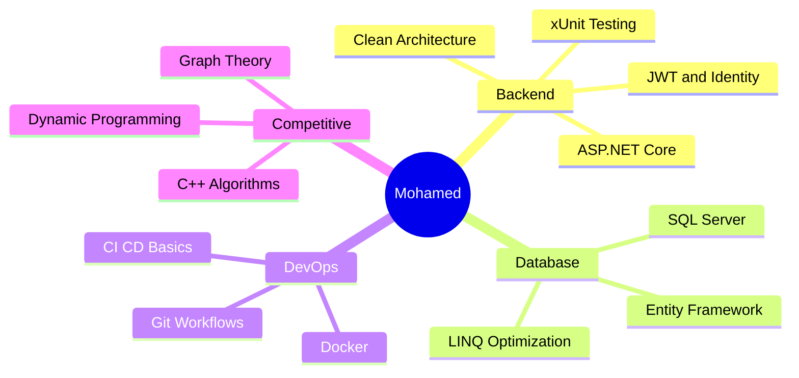

<div align="center">


<a href="https://git.io/typing-svg">
  
</a>

<br/>

[](https://mohamedabobakr.netlify.app)
[](https://linkedin.com/in/mohamed-abobakr-cs)
[](mailto:mabobakr277@gmail.com)

<br/>


</div>

---

## About Me

```yaml
Name        : Mohamed Abobakr Ahmed
Location    : Cairo, Egypt
University  : Cairo University — Faculty of Science
Major       : Computer Science  (3rd Year)
Rank        : 7th in department  |  GPA: 3.0 / 5.0  (Very Good)
Training    : Full-Stack .NET Trainee @ DEPI  (Dec 2025 → Jul 2026)
Competitive : ECPC 2025 — 5th @ Cairo University · 70th Nationally
Status      : Open to backend & full-stack internship opportunities
```

- Currently building **FixIt** — a smart infrastructure issue reporting platform
- Deepening expertise in **ASP.NET Core**, **EF Core**, **JWT Auth** & **Clean Architecture**
- Passionate about **system design**, **clean code**, and **scalable APIs**
- Competed in **ECPC 2025** — solved complex algorithmic problems under pressure in C++
- Ranked **7th out of my entire CS department** at Cairo University
- Reach me at **mabobakr277@gmail.com**

---

## Tech Stack

### Languages
<p>
  
  
  
  
  
</p>

### Backend & Frameworks
<p>
  
  
  
  
  
</p>

### Databases
<p>
  
  
  
</p>

### Frontend
<p>
  
  
  
</p>

### Tools & DevOps
<p>
  
  
  
  
  
  
</p>

### Core CS Concepts
<p>
  
  
  
  
  
  
</p>

---

## Featured Projects

<table>
<tr>
<td width="50%" valign="top">

### FixIt — Smart Issue Reporting


> DEPI Graduation Project · Full-Stack .NET

Web-based infrastructure maintenance platform tracking the full lifecycle of issue reports from citizen submission to resolution and satisfaction rating.

**Key Features:**
- Role-based auth (Citizen / Admin) via JWT & ASP.NET Identity
- Centralized admin dashboard with filtering & status tracking
- RESTful API with xUnit unit tests + Postman suite
- Clean Architecture · EF Core · SQL Server


[](https://github.com/MohamedAbobakr277/FixIt)

</td>
<td width="50%" valign="top">

### UniTrade — Student Marketplace


> Peer-to-peer platform for university students

Secure marketplace for trading textbooks and academic tools at discounted prices, easing financial burdens for students.

**Key Features:**
- Secure peer-to-peer transactions
- Product discovery and listing flow
- Responsive UI for all devices
- Student-focused UX design


[](https://github.com/MohamedAbobakr277/UniTrade)

</td>
</tr>
<tr>
<td width="50%" valign="top">

### Exam System — C# OOP Engine


> DEPI .NET Training · Advanced OOP

Console-based exam engine with 3 question types and 2 exam modes (Practice / Final).

**Key Highlights:**
- Abstract Question base with ICloneable and IComparable
- C# events and delegates with real-time scoring
- File I/O logging via custom QuestionList
- ExamMode enum with clean OOP patterns


[](https://github.com/MohamedAbobakr277/DEPI-Tasks/tree/main/CSharpProjectSolution)

</td>
<td width="50%" valign="top">

### Library Management System


> Cairo University · OOP Architecture

Full library system with CRUD operations and clean object-oriented design.

**Key Highlights:**
- Full book and member management
- Borrowing and return workflows
- Clean OOP class hierarchy
- Java best practices throughout


[](https://github.com/MohamedAbobakr277/library-management-system-java)

</td>
</tr>
</table>

---

## Achievements

<div align="center">

| Achievement | Organization | Date |
|:---|:---|:---:|
| **ECPC 2025** — 5th place at Cairo University, 70th Nationally | Egyptian Collegiate Programming Contest | Aug 2025 |
| **Ranked 7th** in CS Department with GPA 3.0/5.0 (Very Good) | Cairo University | Ongoing |
| **Full-Stack .NET Trainee** in DEPI Program | Digital Egypt Pioneers Initiative | Dec 2025 → Jul 2026 |
| **Competitive Programming** — ICPC Assiut & Cairo Science CPC | ICPC Community | Jan 2024 → Present |

</div>

---

## Certifications

<div align="center">

| Certification | Issuer | Date |
|:---|:---:|:---:|
| **Software Development — Full-Stack .NET** | DEPI | Dec 2025 → Present |
| **Introduction to Software Engineering** | IBM | Jan 2026 |
| **GitHub Foundations** | DataCamp | Dec 2025 |
| **Git and GitHub** | Almadrasa | Dec 2025 |
| **SQL Intermediate** | HackerRank | Dec 2025 |
| **SQL Fundamentals** | DataCamp | Nov 2025 |
| **ECPC Qualifications** | Egyptian Collegiate Programming Contest | Aug 2025 |
| **Principles of Writing Clean Code** | MaharaTech | Jun 2025 |

</div>

---

## GitHub Stats

<div align="center">


&nbsp;


</div>

<div align="center">


</div>

<div align="center">


</div>

---

## Knowledge Map



---

## 2025–2026 Goals

- [x] Qualify for ECPC 2025
- [x] Join DEPI Full-Stack .NET Program
- [x] Launch personal portfolio website
- [ ] Ship FixIt MVP (graduation project)
- [ ] Land a backend / full-stack internship
- [ ] Publish first open-source .NET package
- [ ] Reach 50 GitHub stars across projects

---

<div align="center">

### Let's Connect

[](https://mohamedabobakr.netlify.app)
[](https://linkedin.com/in/mohamed-abobakr-cs)
[](mailto:mabobakr277@gmail.com)

<br/>

*"First, solve the problem. Then, write the code." — John Johnson*

<br/>


</div>
