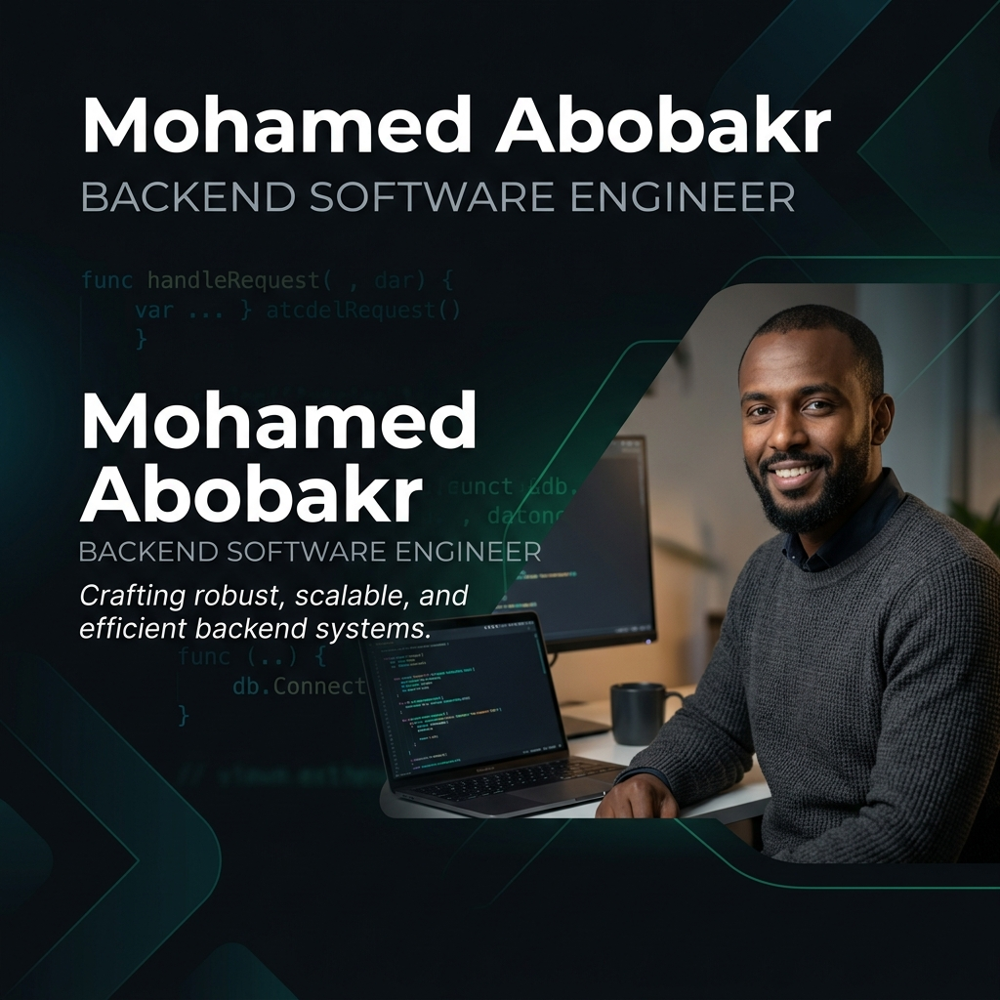

 

<!-- Interactive Typing Animation -->

  
  
  
  

---

## 💫 About Me

<table align="center" width="100%">
  <tr>
    <td width="60%" valign="top">
      

        I am a <b>Computer Science Student at Cairo University</b> (ranked in the top 7 academic tier) and a <b>Backend Specialist</b> with a passion for architecting high-performance systems. My expertise lies within the <b>.NET Ecosystem</b>, where I focus on building scalable, secure, and maintainable enterprise-grade applications.
      

      

        🔭 <b>Current Focus:</b> Deepening my knowledge in Microservices Architecture and System Design.  
        🎓 <b>Education:</b> B.Sc. in Computer Science @ Cairo University (Top 7 Rank).  
        🏆 <b>Competitive Programming:</b> Pupil Rank on Codeforces, solving 600+ complex algorithmic problems.  
        🚀 <b>Active Trainee:</b> Full-Stack .NET Track at Digital Egypt Pioneers Initiative (DEPI).
      

    </td>
    <td width="40%" align="center">
      
    </td>
  </tr>
</table>

---

## 🛠️ Tech Stack & Skills

| **Domain** | **Technologies** |
| :--- | :--- |
| **Languages** |  |
| **Backend** |  |
| **Frontend** |  |
| **Tools** |  |

---

## 🚀 Featured Projects

<table width="100%">
  <tr>
    <td width="50%" valign="top">
      <h3>🔧 FixIt — Issue Reporting Platform</h3>
      
<i>Team Leader & Full-Stack Developer | DEPI Graduation Project</i>

      
A centralized infrastructure maintenance system tracking issues from submission to resolution.

      

        
        
        
      

      <ul>
        <li>Implemented <b>Clean Architecture</b> & Role-based Auth (JWT).</li>
        <li>Developed a documented RESTful API with <b>Swagger</b>.</li>
        <li>Ensured reliability with <b>xUnit</b> testing.</li>
      </ul>
      <a href="https://github.com/MohamedAbobakr277/FixIt"><b>View Repository →</b></a>
    </td>
    <td width="50%" valign="top">
      <h3>📚 UniTrade — Student Marketplace</h3>
      
<i>Peer-to-peer University Platform</i>

      
A secure marketplace for university students to trade textbooks and academic resources.

      

        
        
        
      

      <ul>
        <li>Custom <b>Favorites System</b> for bookmarking items.</li>
        <li>Fully responsive mobile-first design.</li>
        <li>Optimized for low-latency product discovery.</li>
      </ul>
      <a href="https://github.com/MohamedAbobakr277/UniTrade"><b>View Repository →</b></a>
    </td>
  </tr>
  <tr>
    <td width="50%" valign="top">
      <h3>📝 Exam Engine System</h3>
      
<i>Advanced OOP Design Challenge</i>

      
A robust console-based examination engine with multiple modes and question types.

      

        
        
      

      <ul>
        <li>Utilized <b>Abstract Classes</b>, Interfaces, & Events.</li>
        <li>Custom collections with generic type constraints.</li>
        <li>File I/O for persistent state management.</li>
      </ul>
      <a href="https://github.com/MohamedAbobakr277/DEPI-Tasks/tree/main/CSharpProjectSolution"><b>View Repository →</b></a>
    </td>
    <td width="50%" align="center" valign="middle">
      
    </td>
  </tr>
</table>

---

## 📊 GitHub Statistics

 

---

### Let's Build Something Impactful 🚀

*"Simplicity is the soul of efficiency." — Austin Freeman*

  
  
  

